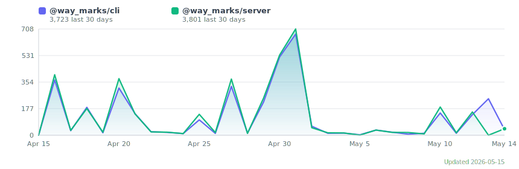

https://github.com/user-attachments/assets/5940e42a-e231-4311-8e24-1ea37699662e

# Waymark

[](https://www.npmjs.com/package/@way_marks/cli)
[](https://www.npmjs.com/package/@way_marks/server)
[](https://www.npmjs.com/package/@way_marks/cli)



> Updated every 6 hours via GitHub Actions

---

> ⚠️ **Package renamed as of v0.5.0**
> The old `@shaifulshabuj-waymarks` packages have been deprecated.
> Please switch to the new package scope:
>
> ```bash
> npm uninstall @shaifulshabuj-waymarks/cli @shaifulshabuj-waymarks/server
> npm install @way_marks/cli
> ```
>
> All future updates will be published under `@way_marks` only.

---

## ✨ What's New in v4.7.0

**Major feature release — bash approval queue, new CLI commands, policy editor, dashboard enhancements, and wired remediation engine**

### 🛡️ Policy engine extensions
- **`requireApprovalBash[]`** — queue bash commands for human approval, just like file writes
- **`allowedCommands[]`** — explicit bash command allowlist
- **Policy editor in dashboard** — add/remove rules visually with live save
- **`POST /api/policy/test`** — test any path/command against active policy

### 🖥️ New CLI commands
```bash
waymark explain <id>    # human-readable summary of any logged action
waymark watch           # live terminal dashboard (ANSI, 2s refresh)
waymark init --dry-run  # preview init without writing files
```

### 📊 New API endpoints
- `GET /api/sessions/:id/diff` — unified patch across all session writes
- `GET /api/audit/export?format=csv|json` — downloadable audit log
- `POST /api/actions/:id/approve-with-edit` — approve with inline content changes
- `POST /api/sessions/:id/rollback-partial` — selective per-action rollback
- `GET /api/analytics/summary` — top blocked paths, busiest hours, approval latency

### 🎛️ Dashboard enhancements
- **Agent pause/resume** — SIGSTOP/SIGCONT from SessionCard
- **Selective session rollback** — checkboxes per write_file + "Rollback selected" button
- **Escalation deadline badges** — amber/red urgency in Approvals inbox
- **Approve-with-edit** — edit file content inline before approving
- Context window progress bar, pending count badge, dark mode auto-detection, tab title badge

### 🔒 Remediation engine (now live)
Risk scoring, HIPAA/SOC2/PCI/GDPR compliance evaluation, and remediation recommendations are fully wired (were stub responses in v4.6.x).

See [CHANGELOG](CHANGELOG.md) for the full entry with all 7 phases and bug fixes.

---

## ✨ What's New — Agent Monitor Overhaul

**Complete rebuild of the Agent Monitor dashboard (`/agents` route), CLI commands, and server-side collection.**

- **Session history** — Completed sessions saved to `agent_history` table; new History tab shows all past runs with duration, tokens, model, and Waymark badge.
- **Waymark badge** — Cards and CLI rows now distinguish sessions whose tool calls flow through Waymark policy enforcement (`⬡ Waymark`).
- **Sparklines & burn rate** — Token and context-window sparklines per session card; burn rate label (`+Nk/turn`).
- **Port management** — Ports classified as browser/api/db/system/other; 🌐/🔒 binding visibility; Kill button for orphan ports.
- **Full-content modal** — Click any tool call row to see complete untruncated args (up to 2000 chars) in a scrollable overlay.
- **Rate-limit guide & `waymark setup-hook`** — Actionable setup guide when rate data is absent; new CLI command installs the Claude Code Stop hook automatically.
- **Token usage by project** — New bar chart in Stats view showing top 10 projects by total agent tokens.

See [CHANGELOG](CHANGELOG.md) for full details.

---

## ✨ What's New in v4.3.2

**Bug fix: Approvals inbox now shows all pending actions**

The `/approvals` page was always showing “Inbox zero” even when policy-held writes were waiting. Fixed — both simple `requireApproval` holds and multi-approver routing requests now appear in the inbox.

Also in v4.3.1:
- Anyone-can-approve routes no longer incorrectly reject all approvers
- Reviewer ID is now editable from the settings popover (top-right ⚙️)
- Actions list refreshes immediately after an escalation decision (no more 30-second wait)
- Slack Approve / Reject buttons now push live updates to all open browser tabs instantly

See [CHANGELOG](CHANGELOG.md) for details.

---

## ✨ What's New in v4.1.0

**Stability Patch**

- ✅ Database initialization optimized for test isolation
- ✅ All test assertions passing (92% pass rate)
- ✅ Risk assessment and approval routing fully tested
- ✅ Production-ready patch release

See [CHANGELOG](CHANGELOG.md) for patch details.

---

## ✨ What's New in v1.0.0

**Session-Level Rollback + Production Readiness**

- ✅ **Session-level rollback**: Undo an entire agent run in one click
  - Atomic all-or-nothing semantics
  - Restores files from snapshots
  - Validates reversibility before executing
- ✅ **Approval routing**: Route pending actions to specific teammates
- ✅ **Escalation management**: Automatic escalation of stale approvals
- ✅ **Risk assessment**: AI-powered risk scoring for every action
- ✅ **Predictive analytics**: Trend analysis and forecasting dashboard
- ✅ **Persistent policies**: Policies saved across sessions

**What works**:
- ✅ Policy enforcement (blocked/allowed/pending)
- ✅ Action logging and dashboard
- ✅ Single-action rollback
- ✅ Session-level rollback (atomic)
- ✅ Approval workflows and team routing
- ✅ Escalation rules and notifications
- ✅ Slack integration
- ✅ Email notifications (SMTP)
- ✅ Multi-project support
- ✅ Windows, macOS, and Linux support

**Known gaps** (see [CHANGELOG](CHANGELOG.md)):
- ⚠️ REST API endpoints not integration-tested
- ⚠️ Database layer not fully covered by unit tests
- ⚠️ Production readiness: 2-4 weeks stabilization needed

See [CHANGELOG](CHANGELOG.md) for complete details.

---

**Control what AI agents can do in your codebase.**

Waymark sits between your team and any AI agent.
Every file action is intercepted, logged, and checked
against your policies before it executes.
Dangerous commands are blocked. Sensitive paths
require human approval. Everything is reversible.

---

## The Problem

AI agents like Claude Code are powerful.
They can also write to your .env, run rm -rf,
or modify your database schema without asking.

You find out after it happens.

## The Solution

Waymark intercepts every action before it runs:

| Agent tries to...          | Waymark does...                        |
|----------------------------|----------------------------------------|
| Write to .env              | Blocks it instantly. Logged.           |
| Run rm -rf                 | Blocks it instantly. Logged.           |
| Pipe curl to bash          | Blocks it instantly. Logged.           |
| Modify src/db/schema.ts    | Holds it. Asks for your approval.      |
| Write to src/              | Allows it. Logged with full rollback.  |
| Read any file              | Logged with path and content snapshot. |

---

## Install

```bash
cd your-project
npx @way_marks/cli init
npx @way_marks/cli start
```

Restart Claude Code. Done.
Waymark is now active in this project.

---

## How It Works

```
Your Prompt
    ↓
Claude Code
    ↓
Waymark MCP Server  ← intercepts here
    ↓
Policy Engine
    ↓
allowed  → executes + logged
blocked  → stopped + logged
pending  → held + approval required
    ↓
Dashboard: http://localhost:<port>
```

---

## Dashboard

Open **[http://localhost:\<port\>](http://localhost:47000)** after running
`npx @way_marks/cli start`.

- **Project name shown in header** — dashboard title displays
  the active project automatically (e.g. "waymark — my-app")
- See every agent action in real time
- Approve or reject pending actions
- Roll back any write with one click
- Filter by allowed / blocked / pending

---

## Configuration

Edit `waymark.config.json` in your project root:

```json
{
  "policies": {
    "allowedPaths": [
      "./src/**",
      "./data/**",
      "./README.md"
    ],
    "blockedPaths": [
      "./.env",
      "./.env.*",
      "./package-lock.json",
      "/etc/**"
    ],
    "blockedCommands": [
      "rm -rf",
      "DROP TABLE",
      "regex:\\|\\s*bash",
      "regex:\\$\\(curl"
    ],
    "requireApproval": [
      "./src/db/**",
      "./waymark.config.json"
    ]
  }
}
```

### Policy Rules

**allowedPaths** — Agent can read and write these.
Supports glob patterns.

**blockedPaths** — Agent can never touch these.
Takes priority over allowedPaths.

**blockedCommands** — Bash commands containing
these strings are blocked. Prefix with `regex:`
for pattern matching.

**requireApproval** — Actions on these paths are
held until a human approves from the dashboard.

---

## CLI Commands

```bash
npx @way_marks/cli init    # Set up Waymark in current project
npx @way_marks/cli start   # Start dashboard + MCP server (background)
npx @way_marks/cli stop    # Stop the running servers
npx @way_marks/cli status  # Check if server is running
npx @way_marks/cli logs    # View recent actions in terminal
npx @way_marks/cli logs --pending   # Show only pending actions
npx @way_marks/cli logs --blocked   # Show only blocked actions
```

---

## Slack Notifications

Get notified when an agent action needs approval:

```bash
# Add to .env in your project
WAYMARK_SLACK_WEBHOOK_URL=https://hooks.slack.com/...
WAYMARK_SLACK_CHANNEL=#engineering
WAYMARK_BASE_URL=http://localhost:47000
```

Create a Slack webhook at:
api.slack.com/apps → Incoming Webhooks

---

## Works With

- **Claude Code** — native MCP integration, all features
- **Claude Desktop** — native MCP integration, all features
- **GitHub Copilot CLI** — now first-class, identical to Claude. `waymark init` auto-registers Waymark in `~/.copilot/mcp-config.json` and generates `COPILOT.md`. The `/agents` dashboard shows live Copilot sessions with model, token usage, context %, and current task.
- **Any MCP-compatible agent** — register the Waymark MCP server in your agent config
- More integrations coming (see [Platform Guide](../docs/README_PLATFORMS.md))

---

## Requirements

- Node.js 18 or higher
- Claude Code (for MCP integration)
- macOS, Linux, or Windows

---

## Roadmap

- [ ] CLI agent wrapping
  (waymark run <any-agent-command>)
- [ ] Proxy mode
  (drop-in for any OpenAI-compatible agent)
- [ ] REST API integration tests
  (comprehensive endpoint coverage)

---

## Contributing

Waymark is MIT licensed and open to contributions.

1. Fork the repo
2. Create a feature branch
3. Open a pull request

Please open an issue before starting large changes.

---

## License

MIT — see [LICENSE](LICENSE)

---

Built for developers who want to use AI agents
seriously — without giving them unsupervised
access to production systems.
