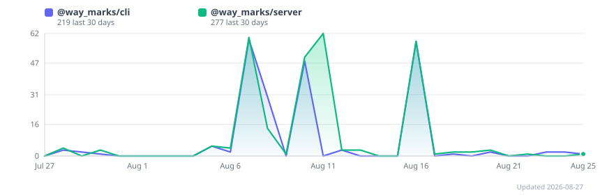

https://github.com/user-attachments/assets/ed36654a-29c4-46ee-b331-5b9afde2b932

# waymark

**Human oversight as a property of the system, not a property of the agent.**

Waymark is MCP middleware that sits between an AI agent and the filesystem. Every `write_file` and `bash` call is evaluated against your policy before it touches anything — blocked, held for approval, or logged and allowed. Nothing the agent does is permanent until you say so.

[](https://www.npmjs.com/package/@way_marks/cli)
[](https://www.npmjs.com/package/@way_marks/server)
[](https://www.npmjs.com/package/@way_marks/cli)
[](https://shaifulshabuj.github.io/waymark/)



> Updated every 6 hours via GitHub Actions

---

## Three Pillars

### Control — enforce the rules you set, unconditionally

Policy lives in `waymark.config.json`, not in a system prompt. An agent cannot forget a rule, be jailbroken past it, or accumulate enough context to override it. Every tool call is evaluated in Node.js process space before the filesystem is touched.

```
blockedPaths    → BLOCK    (hard deny — secrets, system files)
requireApproval → PENDING  (human must approve before execution)
allowedPaths    → ALLOW    (execute immediately, log it)
(default)       → BLOCK    (unknown paths are rejected)
```

### Observe — know what is happening, in real time and historically

The action ledger records every tool call to SQLite with decision, reason, output, and timestamps. The dashboard at `http://localhost:47000` is always available. `waymark watch` gives you an ANSI terminal view. The Agent Monitor (`/agents`) shows every AI session on the machine — model, context%, tokens, turns, rate limits — as a live btop-style table.

### Recover — every write is undoable

Before-snapshots are captured at write time. A single action can be rolled back. An entire session can be atomically undone in reverse order. Approving a write knowing you can roll it back is categorically different from approving without a net.

---

## 60-Second Quickstart

### Option A — Zero global install

```bash
cd your-project
npx @way_marks/cli init --yes   # create waymark.config.json + CLAUDE.md, register MCP
npx @way_marks/cli start        # start server, open dashboard at localhost:<port>
```

Restart Claude Desktop or reload your Claude Code session to pick up the new MCP server. Done.

### Option B — Global install with daemon (recommended for v5)

```bash
npm install -g @way_marks/cli
waymark global-setup            # register universal MCP entry once across all hosts
cd your-project
waymark init                    # project-specific init (idempotent — safe to re-run)
waymark daemon start            # start one daemon at localhost:47000 for all projects
```

```bash
waymark daemon status           # list registered projects + uptime
waymark status                  # check this project's status + pending count
waymark logs --pending          # show pending actions waiting for approval
```

The daemon serves all your registered projects from a single process. Switch projects in the dashboard via the **Active Project** dropdown.

---

## Part of a Suite

Waymark is the control plane of a four-tool developer suite:

| Tool | Role | What it does |
|------|------|--------------|
| [devloop](https://github.com/shaifulshabuj/devloop) | Build | Multi-agent dev pipeline — architect → worker → reviewer loop |
| **waymark** | **Run** | **Policy enforcement + observability for AI agents** |
| [teststop](https://github.com/shaifulshabuj/teststop) | Break | Adversarial scenario testing — acts as a real, impatient user |
| [docuflow](https://github.com/shaifulshabuj/docuflow-mcp) | Document | Decision-context wiki for AI agents |

**Adversarial testing:** teststop runs 52 predicted risk scenarios against waymark's live API, targeting edge cases a real user would hit — concurrent approvals, stale tabs, rollback races, policy bypass attempts. See [`examples/waymark-demo`](https://github.com/shaifulshabuj/teststop/tree/main/examples/waymark-demo) for the full scenario set and confidence report. The v5.0.13–v5.0.16 safety fixes were all surfaced by this suite.

---

## Platform Support

| Platform | Status | Features | Setup |
|----------|--------|----------|-------|
| **Claude Desktop** | ✅ Recommended | Full features | `waymark init` |
| **Claude Code** | ✅ Recommended | Full features | `waymark init` |
| **GitHub Copilot CLI** | ✅ Supported | Full features | `waymark init` |
| **GitHub Copilot Chat** | ⏳ Future | Waiting for GitHub MCP | See [Platform Guide](docs/README_PLATFORMS.md) |
| **CodeWhisperer, Codeium, others** | ⏳ Future | Waiting for MCP adoption | See [Platform Guide](docs/README_PLATFORMS.md) |

**👉 For detailed platform information, see [docs/README_PLATFORMS.md](docs/README_PLATFORMS.md)**

---

## 📚 Documentation

**Full documentation site:** **[shaifulshabuj.github.io/waymark](https://shaifulshabuj.github.io/waymark/)**

Covers installation, quickstart, CLI reference, API reference, policy engine, approvals, rollback, agent monitor, philosophy, and changelog.

**User stories and feature walkthroughs:** **[docs/user-stories/README.md](docs/user-stories/README.md)**

- [Feature 01: Team Approval Routing](docs/user-stories/feature-01-approval-routing/) — Human-in-the-loop control for sensitive changes
- [Feature 02: Session-Level Rollback](docs/user-stories/feature-02-session-rollback/) — Atomic undo for entire AI agent runs
- [Feature 03: Email Notifications](docs/user-stories/feature-03-email-notifications/) — SMTP-based alerts for pending approvals
- [Feature 04: Multi-Platform Support](docs/user-stories/feature-04-multi-platform/) — Consistent governance on Windows, macOS, and Linux
- [Feature 05: Agent Monitor](docs/user-stories/feature-05-agent-monitor/) — Live observability for running and completed AI agent sessions
- [Feature 06: Enterprise Notifications & Analytics](docs/user-stories/feature-06-enterprise-notifications/) — Block persistence, webhook fan-out, email approval tokens, per-member prefs, and analytics cards

---

## Changelog

See [CHANGELOG.md](CHANGELOG.md) for the full release history.

Recent highlights:
- **v5.0.20** — `maxBashTimeoutMs` policy: per-call bash timeout clamping via `waymark.config.json`
- **v5.0.16** — 30+ robustness fixes + complete Vitest migration (624 tests, 33 files)
- **v5.0.13** — 17 P0 safety fixes surfaced by teststop adversarial testing
- **v5.0.0** — Unified daemon architecture: one process, all projects, one URL

---

## Architecture

```
┌──────────────────────────────────────────────────┐
│                 mcp/server.ts                    │
│                                                  │
│  1. loadConfig()          → policies/engine.ts   │
│  2. checkFileAction()                            │
│     or checkBashAction()                         │
│                                                  │
│  3a. decision=block  → insertAction(blocked)     │
│                         throw Error (no exec)    │
│                                                  │
│  3b. decision=pending → insertAction(pending)    │
│                         notifyPendingAction()    │
│                         return message+action_id │
│                         (agent can poll status)  │
│                                                  │
│  3c. decision=allow  → insertAction(allow)       │
│                         execute tool             │
│                         updateAction(result)     │
└──────────────────────────────────────────────────┘
         │                        ▲
         │ SQLite                 │ REST API
         ▼                        │
┌─────────────┐        ┌──────────────────────────┐
│ data/       │        │      api/server.ts        │
│ waymark.db  │◄───────│  GET  /api/actions        │
└─────────────┘        │  GET  /api/actions/:id    │
                       │  POST /api/actions/:id/   │
                       │        approve            │
                       │  POST /api/actions/:id/   │
                       │        reject             │
                       │  GET  /api/actions/:id/   │
                       │        status             │
                       │  POST /api/actions/:id/   │
                       │        rollback           │
                       │                           │
                       │  [Phase 1: Sessions]      │
                       │  GET  /api/sessions       │
                       │  GET  /api/sessions/:id   │
                       │  GET  /api/sessions/:id/  │
                       │        actions            │
                       │  POST /api/sessions/:id/  │
                       │        rollback           │
                       │  GET  /api/sessions/:id/  │
                       │        status             │
                       │                           │
                       │  POST /api/slack/interact │
                       │  GET  /api/config         │
                       │  GET  /  → index.html     │
                       └──────────────────────────┘
                                  ▲
                          Browser http://localhost:&lt;port&gt;
```

Three packages, seven server modules, two runtime processes. The dashboard is a separate React + Vite app (`packages/web`) whose build output is served statically by the API process.

**`packages/server/`** — MCP server + API server + UI host

| File | Process | What it does | Imports |
| ------ | --------- | -------------- | --------- |
| `packages/server/src/mcp/server.ts` | MCP (stdio) | Exposes tools to AI agent, enforces policy, logs actions, sends Slack notifications | `db/database`, `policies/engine`, `notifications/slack` |
| `packages/server/src/api/server.ts` | API (default port from 47000-47999) | REST API + serves the built React dashboard from `src/ui-dist/`. Port set via `WAYMARK_PORT` env var by the CLI; pinnable via `port` in `waymark.config.json` or `waymark start --port <n>`. | `db/database`, `policies/engine`, `approvals/handler` |
| `packages/server/src/db/database.ts` | both | SQLite schema, prepared statements, CRUD functions | `better-sqlite3` |
| `packages/server/src/policies/engine.ts` | both | Loads config, evaluates file/bash actions against rules | `micromatch` |
| `packages/server/src/notifications/slack.ts` | MCP (stdio) | Sends Slack Block Kit message for pending actions; silent if webhook not configured | `db/database` (ActionRow type) |
| `packages/server/src/approvals/handler.ts` | API (port from CLI) | Re-executes approved write_file actions; marks approved/rejected in DB | `db/database`, `fs` |
| `packages/server/src/ui-dist/` | browser | **Vite build output** — the React dashboard (produced by `packages/web`). If missing, the API serves a small setup page pointing to the build command. | — |
| `packages/server/src/api/events.ts` | API (port from CLI) | Server-Sent Events broadcaster; emits per-topic events on every mutation so the UI can invalidate without polling. | — |
| `packages/server/src/collectors/` | API only (single `setInterval`, `.unref()`d) | btop-style agent monitor (added in 4.1). `MultiCollector.tick()` orchestrates `claude.ts` / `codex.ts` / `copilot.ts` collectors on a 2 s fast tick + 10 s slow tick (`ps`, `lsof`, `git`); applies `normalizeSession()` to every row (number/array defaults, status clamp, `redactSecrets()` over free text); JSONL parsing wraps each `JSON.parse(line)` in `try/catch` so a corrupted line skips rather than poisons the tick. Outputs `CollectorSnapshot { sessions, rateLimits, orphanPorts, collectedAt }`. | `process.ts`, `secrets.ts`, `rate-limit.ts`, `types.ts` |
| `packages/server/src/api/routes/agent-monitor.ts` | API (port from CLI) | REST endpoints under `/api/agent-monitor/*` (sessions, rate-limits, ports, snapshot). Filterable by `?agent=` and `?status=`. | `collectors/multi-collector` |
| `packages/server/src/mcp/tools/agent-monitor.ts` | MCP (stdio) | Three read-only MCP tools — `list_agent_sessions`, `get_rate_limits`, `get_agent_ports`. Bypass the action log. The MCP process does **not** run its own collector; `fetchSnapshotFromApi()` calls `http://127.0.0.1:<port>/api/agent-monitor/snapshot` on demand (returns an empty snapshot if the API is offline). Single source of truth, no parallel `ps` polls. | `api/routes/agent-monitor` (via HTTP) |

**`packages/web/`** — React + Vite dashboard (added in 2.0.3)

| Area | Purpose |
| ----- | -------- |
| `vite.config.ts` | Build output goes to `../server/src/ui-dist/`; dev server on :5173 with `/api` proxied to the running Waymark server (set `WAYMARK_API` env var to override the proxy target) |
| `src/api/` | Typed fetch client + TanStack Query hooks (3-second `refetchInterval`, invalidate-on-success mutations) |
| `src/components/AppShell` | 232 px sidebar + topbar with Cmd-K search + live MCP status footer |
| `src/components/{Drawer,ActionRow,SessionGroup,Icon,TweaksPopover,ConfirmModal,ToastContext}` | Cross-screen primitives |
| `src/features/actions/` | Feature-complete Actions screen (filter pills, session groups, approve/reject/rollback) |
| `src/features/agent-monitor/` | btop-style live agent view (added in 4.1) — `AgentMonitorView`, `SessionCard`, `RateLimitBadge`, `PortsList`. Polls `/api/agent-monitor/*` every 3 s. |
| `src/features/ComingSoon.tsx` | Placeholders for Sessions/Approvals/Policy/Stats/Settings (Phases 2–4) |
| `src/store/ui.ts` | Zustand store for `theme`, `density`, `grouping`, `accent`, `filter`, `search`, `selectedActionId`; persisted to `localStorage` as `waymark:ui` |
| `src/styles/{tokens,global}.css` | oklch-based dark + light tokens, IBM Plex Sans/Mono self-hosted, density variants, semantic colors, responsive breakpoints |

**`packages/cli/`** — `waymark` CLI (`init`, `start`, `stop`, `status`, `logs`)

| File | What it does |
| ------ | -------------- |
| `packages/cli/src/index.ts` | Entry point — routes `process.argv[2]` to command modules |
| `packages/cli/src/commands/init.ts` | `waymark init` — creates config, CLAUDE.md (and `COPILOT.md` when copilot-cli is selected), updates .gitignore, registers MCP in Claude config and `~/.copilot/mcp-config.json` |
| `packages/cli/src/commands/agents.ts` | `waymark agents` (added in 4.1) — fixed-column table of live AI coding agent sessions (Claude, Codex, Copilot CLI). Flags: `--agent`, `--active`, `--json`, `--limit` |
| `packages/cli/src/commands/start.ts` | `waymark start` — spawns API + MCP servers as detached background daemons, writes `.waymark/waymark.pid`, opens browser, exits immediately |
| `packages/cli/src/commands/stop.ts` | `waymark stop` — reads `.waymark/waymark.pid`, SIGTERMs both processes, deletes PID file |
| `packages/cli/src/commands/status.ts` | `waymark status` — reads PID file, uses `process.kill(pid, 0)` liveness check, prints pending count and server state; auto-cleans stale PID file on crash |
| `packages/cli/src/commands/logs.ts` | `waymark logs` — prints action table; supports `--pending`, `--blocked`, `--limit N` |

The two server processes run concurrently and share the same SQLite file. The MCP process writes; the API process reads. SQLite handles concurrent access safely because all database calls are **synchronous** (`better-sqlite3`).

---

## CLI Reference

```bash
waymark init               # first-time setup (idempotent — safe to re-run)
waymark init --yes         # non-interactive, accept all defaults
waymark init --dry-run     # preview what would be created without writing files
waymark global-setup       # register universal MCP entry across all supported hosts
waymark cleanup-mcp        # remove stale per-project waymark-* entries

waymark daemon start       # start global daemon (port 47000, serves all projects)
waymark daemon stop        # stop the daemon
waymark daemon status      # list registered projects + uptime
waymark daemon restart     # reload after upgrading

waymark service install    # auto-start daemon on login (launchd/systemd)
waymark service uninstall  # remove auto-start

waymark start              # start per-project API + MCP server in background
waymark stop               # stop the background servers
waymark status             # check if server is running + pending count + port

waymark logs               # print recent action table
waymark logs --pending     # only pending actions
waymark logs --blocked     # only blocked actions
waymark logs --limit 50    # show up to 50 rows (default: 20)

waymark agents             # live table of AI coding agent sessions
waymark agents --json      # full token / tool / turn breakdown
waymark watch              # live ANSI terminal dashboard (2s refresh)

waymark explain <id>       # human-readable summary of any action
waymark doctor             # validate dependencies and configuration
waymark update             # self-upgrade to latest version
waymark relocate           # update registry after rename/move

waymark global-config init # create global defaults in ~/.waymark/global.config.json
waymark team add <email>   # add a team member
waymark workspace create   # group related projects
```

---

## waymark.config.json Reference

Waymark reads `waymark.config.json` from the project root **fresh on every tool call** — no restart needed when you edit it.

```json
{
  "version": "1",
  "policies": {
    "allowedPaths":    ["./src/**", "./data/**", "./README.md"],
    "blockedPaths":    ["./.env", "./.env.*", "./package-lock.json", "/etc/**", "/usr/**"],
    "blockedCommands": [
      "rm -rf",
      "DROP TABLE",
      "regex:\\|\\s*bash",
      "regex:\\|\\s*sh\\b"
    ],
    "requireApproval": ["./src/db/**", "./waymark.config.json"],
    "maxBashOutputBytes": 10000,
    "maxBashTimeoutMs": 120000
  }
}
```

### Field reference

| Field | Type | Description |
| ------- | ------ | ------------- |
| `allowedPaths` | `string[]` | Glob patterns for paths agents may read/write. Relative patterns resolve from the project root. |
| `blockedPaths` | `string[]` | Glob patterns that are always denied. Checked before `allowedPaths`. |
| `blockedCommands` | `string[]` | Bash rules. Plain strings match as substrings; `regex:` prefix enables regex matching. |
| `requireApproval` | `string[]` | Glob patterns that are logged as `pending` and not executed — manual approval required. |
| `maxBashOutputBytes` | `number` | Cap on stdout/stderr bytes returned per bash call (default: 10000). Output beyond this limit is truncated with `[OUTPUT TRUNCATED]`. |
| `maxBashTimeoutMs` | `number` | Per-call bash timeout cap in ms (clamped to 1000–600000). Overrides the MCP client's default. |

### File action precedence

For every `write_file` or `read_file` call, the path is tested in this order:

```markdown
1. blockedPaths?    → decision: block   (throws error, file not touched)
2. requireApproval? → decision: pending (returns message with action_id, file not touched)
3. allowedPaths?    → decision: allow   (proceeds)
4. (default)        → decision: block   ("Path not in allowedPaths")
```

### blockedCommands: plain string vs regex

```jsonc
// Substring match — blocks any command containing "rm -rf"
"rm -rf"

// Regex match — blocks any pipe to bash (curl url | bash, cat x | bash, etc.)
"regex:\\|\\s*bash"

// Regex match — blocks command substitution with curl
"regex:\\$\\(curl"
```

Regex rules use JavaScript `RegExp` with the `i` (case-insensitive) flag. Invalid regex entries are skipped with a `console.warn`.

### Pattern matching

Relative patterns (`./src/**`) are resolved to absolute paths from the project root before matching. Absolute patterns (`/etc/**`) pass through unchanged. Matching uses `micromatch` with `{ dot: true }` so dotfiles (`.env`) are included.

---

## REST API Reference

All endpoints are served by `api/server.ts` on the project's allocated port (default range `47000-47999`; pin with `port` in `waymark.config.json` or `--port` flag). Run `waymark status` to see the live URL.

| Method | Path | Response | Notes |
| ------- | ------ | ---------- | ------- |
| `GET` | `/api/actions` | `ActionRow[]` | Last 100 actions, newest first |
| `GET` | `/api/actions?count=true` | `{ count: number }` | Count of pending actions; used by UI badge |
| `GET` | `/api/actions/:action_id` | `ActionRow` | Single action by UUID |
| `GET` | `/api/actions/:action_id/status` | `{ status, decision, approved_by?, approved_at?, rejected_reason?, rejected_at? }` | Lightweight status for agent polling |
| `POST` | `/api/actions/:action_id/approve` | `{ success, action }` | Executes the original action; sets `approved_by='ui'` |
| `POST` | `/api/actions/:action_id/reject` | `{ success, action }` | Body: `{ reason?: string }`; marks rejected, does not execute |
| `POST` | `/api/actions/:action_id/rollback` | `{ success, action, message }` | `write_file` only; see Rollback section |
| `POST` | `/api/slack/interact` | `{ text }` | Slack interactive components endpoint; requires public URL (use ngrok locally) |
| `GET` | `/api/sessions` | `{ session_id, action_count, latest }[]` | Grouped by MCP server process start |
| `GET` | `/api/config` | `WaymarkConfig` | Current parsed `waymark.config.json` |
| `GET` | `/` | HTML | Web dashboard (`src/ui/index.html`) |

### Pending action flow

When `decision=pending`, the MCP server:
1. Logs the action to DB with `status='pending'`
2. Fires a Slack notification (if `WAYMARK_SLACK_WEBHOOK_URL` is set in `.env`)
3. Returns a message to the agent containing the `action_id` and the polling URL:
   ```
   Action requires approval.
   Action ID: <uuid>
   Check status: GET /api/actions/<uuid>/status
   ```
   The agent can poll `/api/actions/:id/status` and continue other work while waiting.

On **approve**: `approvePendingAction` re-executes the original tool (writes the file for `write_file`), sets `status='success'`, `decision='allow'`, and records `approved_by` + `approved_at`.

On **reject**: `rejectPendingAction` sets `status='rejected'` and records `rejected_reason` + `rejected_at`. The file is never written.

### Slack setup

Slack integration is **optional**. If `WAYMARK_SLACK_WEBHOOK_URL` is empty, notifications are silently skipped and approval works entirely from the UI dashboard.

There are two independent pieces:
1. **Incoming webhook** — posts a notification card when an action goes pending (one-way, read-only setup)
2. **Interactive components** — lets you approve/reject directly from the Slack message (requires a public URL)

You can use (1) without (2). Notifications will arrive but the buttons won't work.

#### Step 1 — Create a Slack App

1. Go to [https://api.slack.com/apps](https://api.slack.com/apps) → **Create New App** → **From scratch**
2. Name it `Waymark`, pick your workspace → **Create App**

#### Step 2 — Incoming Webhook (notifications)

1. In your app's sidebar: **Incoming Webhooks** → toggle **Activate Incoming Webhooks** ON
2. Click **Add New Webhook to Workspace** → pick the channel (e.g. `#engineering`) → **Allow**
3. Copy the webhook URL — it looks like `https://hooks.slack.com/services/T.../B.../...`
4. Add to `.env`:

```
WAYMARK_SLACK_WEBHOOK_URL=https://hooks.slack.com/services/T.../B.../...
WAYMARK_SLACK_CHANNEL=#engineering
WAYMARK_BASE_URL=http://localhost:47000
```

`WAYMARK_BASE_URL` is used to build the "View in Dashboard" link inside the Slack card. Set it to whatever URL your Waymark UI is reachable at.

Restart the server. The next pending action will post a card to Slack.

#### Step 3 — Interactive Components (approve/reject buttons)

The Approve and Reject buttons in the Slack card POST to `POST /api/slack/interact`. Slack requires this endpoint to be publicly reachable over HTTPS.

**For local development — use ngrok:**

```bash
ngrok http 47000
```

Copy the `https://` forwarding URL (e.g. `https://abc123.ngrok-free.app`).

1. In your Slack app sidebar: **Interactivity & Shortcuts** → toggle **Interactivity** ON
2. Set **Request URL** to: `https://abc123.ngrok-free.app/api/slack/interact`
3. Click **Save Changes**

> ngrok URLs change on every restart. Update the Request URL in Slack each time.

**For production — set a stable public URL:**

Deploy Waymark behind a reverse proxy (nginx, Caddy, etc.) with TLS, then set the Request URL once to `https://your-domain.com/api/slack/interact`. Update `WAYMARK_BASE_URL` in `.env` to match.

#### Step 4 — Verify

1. Trigger a pending action (write to a `requireApproval` path via the MCP tool)
2. A card should appear in your Slack channel with **Approve** and **Reject** buttons
3. Click **Approve** — the button should update the message and the UI dashboard should show the action as `success / allow`

#### Troubleshooting

| Symptom | Cause | Fix |
|---------|-------|-----|
| No Slack message appears | `WAYMARK_SLACK_WEBHOOK_URL` empty or wrong | Check `.env`, restart server |
| Buttons do nothing | Request URL not set or ngrok restarted | Update Interactivity URL in Slack app settings |
| `dispatch_failed` error in Slack | Waymark returned non-200 or timed out | Check server logs; ensure `/api/slack/interact` is reachable |
| `cannot_parse_subscription` | Webhook URL is malformed | Re-copy URL from Slack app settings |
| Buttons appear but action stays pending | `approved_by` not set | Check server logs for handler errors |

---

## Database Schema

Single table: `action_log` in `data/waymark.db`.

| Column | Type | Nullable | Description |
| ------- | ------ | ---------- | ------------- |
| `id` | INTEGER | NO | Auto-increment primary key |
| `action_id` | TEXT | NO | UUID — unique per tool call |
| `session_id` | TEXT | NO | UUID — shared across all calls in one MCP server process |
| `tool_name` | TEXT | NO | `write_file`, `read_file`, or `bash` |
| `target_path` | TEXT | YES | Absolute file path for write/read; `null` for bash |
| `input_payload` | TEXT | NO | JSON-serialized tool arguments |
| `before_snapshot` | TEXT | YES | File content before write (`write_file` only); `null` if file didn't exist |
| `after_snapshot` | TEXT | YES | File content after write, or file content for reads |
| `status` | TEXT | NO | `pending` → `success` / `error` / `blocked` |
| `error_message` | TEXT | YES | Error detail when status=error |
| `stdout` | TEXT | YES | bash stdout output |
| `stderr` | TEXT | YES | bash stderr output |
| `rolled_back` | INTEGER | NO | `0` or `1` |
| `rolled_back_at` | TEXT | YES | ISO datetime of rollback |
| `created_at` | DATETIME | NO | Row creation time |
| `decision` | TEXT | NO | Policy decision: `allow`, `block`, or `pending` |
| `policy_reason` | TEXT | YES | Human-readable reason for the decision |
| `matched_rule` | TEXT | YES | The specific rule that matched (e.g. `./.env`, `rm -rf`, `regex:\|\s*bash`) |
| `approved_at` | TEXT | YES | ISO datetime when approved |
| `approved_by` | TEXT | YES | `'ui'` or `'slack'` |
| `rejected_at` | TEXT | YES | ISO datetime when rejected |
| `rejected_reason` | TEXT | YES | Human-provided rejection reason |

Schema migrations use `try { ALTER TABLE ADD COLUMN ... } catch {}` — safe to run against existing databases.

---

## Rollback

Rollback is available for `write_file` actions only. The UI shows a "rollback" or "delete (new file)" button in the Action column.

**Overwrite rollback**: `before_snapshot` is non-null → the file existed before. Rollback writes `before_snapshot` back to `target_path`.

**New file rollback**: `before_snapshot` is null → the file was created from scratch. Rollback calls `fs.unlinkSync(target_path)` — the file is deleted.

**Blocked actions** never modify the filesystem, so they have no rollback button.

**Pending actions** also never modify the filesystem until explicitly approved. After approval, the approved action row shows a ✅ Approved badge instead of a rollback button.

Once rolled back, `rolled_back=1` is set and the action cannot be rolled back again.

---

## Plan Mode Logging & Observability

Waymark logs **execution-phase tool calls only** — not plan-mode reads, not internal reasoning. Only actual MCP tool calls (`write_file`, `read_file`, `bash`) appear in the ledger. This is a protocol-level constraint: MCP has no mechanism for "I'm thinking about this file" vs "I'm executing with this file."

---

## For AI Agents

Key facts for working with this codebase:

**Module dependency order** (bottom-up):
```markdown
micromatch, better-sqlite3, express, dotenv, fetch (Node 18+ built-in)
    ↓
packages/server/src/db/database.ts            (no imports from waymark modules)
packages/server/src/policies/engine.ts        (no imports from waymark modules)
    ↓
packages/server/src/notifications/slack.ts    (imports db/database for ActionRow type only)
packages/server/src/approvals/handler.ts      (imports db/database)
    ↓
packages/server/src/mcp/server.ts             (imports database + engine + notifications/slack)
packages/server/src/api/server.ts             (imports database + engine + approvals/handler)
```

**Path resolution — `WAYMARK_PROJECT_ROOT`**: Both `database.ts` and `policies/engine.ts` resolve their data/config paths via:
```typescript
const PROJECT_ROOT = process.env.WAYMARK_PROJECT_ROOT || process.cwd();
const DATA_DIR = path.join(PROJECT_ROOT, 'data');           // database.ts
const CONFIG_PATH = path.join(PROJECT_ROOT, 'waymark.config.json');  // engine.ts
```
`WAYMARK_PROJECT_ROOT` is set by the `--project-root` CLI argument parsed at the very top of `mcp/server.ts` **before any imports** (because `database.ts` and `engine.ts` read the env var at module load time). When running via `waymark start`, `process.cwd()` is the project directory so the fallback works correctly.

**Database is synchronous**: `better-sqlite3` is used throughout. There is no `await` on any database call. Do not introduce async database wrappers.

**Config is read fresh every call**: `loadConfig()` in `engine.ts` reads and parses `waymark.config.json` on every invocation. No caching. Changes to the config file take effect immediately without restarting the MCP server.

**MCP server must be restarted to pick up recompiled code**: The policy config is hot-reloaded, but the TypeScript-compiled JavaScript is not. After `npm run build`, restart Claude Desktop (or the MCP process) for engine changes to take effect.

**SESSION_ID** is a UUID generated once per MCP server process start (`const SESSION_ID = uuidv4()` at module level in `mcp/server.ts`). It groups all tool calls within one session.

**Environment variables** (loaded via `dotenv/config` as first import in both server files):
- `WAYMARK_PROJECT_ROOT` — absolute path to the project being monitored; determines where `data/waymark.db` and `waymark.config.json` are read from. Set via `--project-root` CLI arg or `waymark start`. Falls back to `process.cwd()`.
- `WAYMARK_SLACK_WEBHOOK_URL` — Slack incoming webhook; if empty, Slack notifications are silently skipped
- `WAYMARK_SLACK_CHANNEL` — informational only, not used in code (webhook targets its own channel)
- `WAYMARK_BASE_URL` — used to build "View in Dashboard" link in Slack messages (default: `http://localhost:47000`)

**Route registration order** in `api/server.ts` is significant: `/approve`, `/reject`, `/status` sub-routes are registered before the `/:action_id` catch-all GET, otherwise Express would match the sub-routes as action IDs.

**Before modifying `mcp/server.ts`**: the policy check must remain before `insertAction` for blocked/pending cases — these actions must never touch the filesystem. For pending, the Slack notification fires after `insertAction` with an inline ActionRow object (no DB round-trip).

**Before modifying `policies/engine.ts`**: the precedence order (blocked → pending → allowed → default deny) is load-bearing. Changing it changes observable behavior for all callers.

**Known gaps**:
- No rate limiting on API endpoints
- `getActions()` is hardcoded to `LIMIT 100` with no pagination

---

## Documentation

The full documentation lives in [`docs/`](docs/). Start at [`docs/README.md`](docs/README.md) for a grouped index of every guide.

Most-used pages:

- [`FEATURES.md`](FEATURES.md) — High-level feature list.
- [`docs/FAQ.md`](docs/FAQ.md) — Frequently asked questions.
- [`docs/APPROVALS.md`](docs/APPROVALS.md) · [`docs/ESCALATIONS.md`](docs/ESCALATIONS.md) · [`docs/REMEDIATION.md`](docs/REMEDIATION.md) — Approval, escalation, and rollback workflows.
- [`docs/SESSIONS.md`](docs/SESSIONS.md) — Agent session tracking.
- [`docs/README_PLATFORMS.md`](docs/README_PLATFORMS.md) — Supported platforms.
- [`docs/COPILOT_CLI.md`](docs/COPILOT_CLI.md) — GitHub Copilot CLI integration.
- [`docs/user-stories/README.md`](docs/user-stories/README.md) — Feature walkthroughs with screenshots.
- [`docs/PHASES.md`](docs/PHASES.md) · [`docs/RELEASES.md`](docs/RELEASES.md) — Phase and release indexes.
- [`CLAUDE.md`](CLAUDE.md) · [`AGENTS.md`](AGENTS.md) — Agent rules when Waymark is active.
- [`docs/philosophy.md`](docs/philosophy.md) — The full philosophy behind why Waymark exists.

---

---

## Install

```bash
npm install -g @way_marks/cli
```

## About this repository

This repository is the **public documentation** for waymark. It contains usage guides, reference and
release notes — **not the source code**. waymark is a commercial product; the implementation is
developed privately.

- **Install:** `npm install -g @way_marks/cli`
- **Docs:** the `docs/` directory in this repository
- **Issues and questions:** open an issue here

© Shaiful Shabuj. All rights reserved. Documentation in this repository may be read and shared for the
purpose of using waymark; the software itself is not open source.
