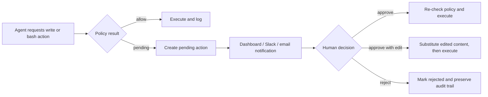

# Approvals & Rollback

Waymark's human-control story combines approval queues, notifications, and rollback data. Some actions should stop until a person makes a decision; other actions should be reversible after they execute. Waymark supports both.

## Covered features

- **F-09 — Single-action approval**
- **F-10 — Rollback**
- **F-11 — Slack notifications**
- **F-11B — Email notifications**
- **F-18 — Atomic session rollback**
- **F-41 — Approve with edit**
- **F-42 — Selective rollback**
- **F-43 — Replay**

## Approval flow



## Single-action approval

For file writes, `requireApproval` sends matching operations into a pending queue rather than executing immediately. The action is stored in `action_log`, shown in the dashboard, and can be approved or rejected later.

For shell commands, `requireApprovalBash` does the same thing. On approval, Waymark re-checks policy before calling the command to avoid stale-approval races.

## Approve with edit

`POST /api/actions/:id/approve-with-edit` lets a reviewer modify pending file content before execution. The dashboard drawer pre-fills the original pending content, so approval becomes a controlled handoff instead of a binary yes/no choice.

```bash
curl -X POST http://localhost:47000/api/actions/<id>/approve-with-edit \
  -H "Content-Type: application/json" \
  -d '{"content":"// reviewer-adjusted content\n","approved_by":"team-lead"}'
```

## Notifications

### Slack

Waymark can post pending actions to Slack using Block Kit messages when `SLACK_WEBHOOK_URL` is configured. Approve and reject buttons call back into `/api/slack/interact`, and successful decisions emit SSE updates so the dashboard refreshes immediately.

### Email

The docs and feature model include email as a notification path for approval workflows. Use it as the escalation-friendly complement to Slack when approvers are not always in the dashboard.

## Rollback mechanics

Rollback is powered by `before_snapshot`. When a write action runs, Waymark keeps the file state from before execution.

- If `before_snapshot` contains prior content, rollback restores it.
- If the file did not exist before, rollback deletes the created file.
- Rollback metadata is stored on the action row so the audit trail remains intact.

## Session rollback

Atomic session rollback uses the action set associated with a `session_id`. Waymark validates that the session is rollbackable, restores files from the recorded snapshots, marks actions as rolled back, and updates the session status.

```bash
curl -X POST http://localhost:47000/api/sessions/<session_id>/rollback
```

If only some writes should be undone, use partial rollback:

```bash
curl -X POST http://localhost:47000/api/sessions/<session_id>/rollback-partial \
  -H "Content-Type: application/json" \
  -d '{"action_ids":["act-1","act-2"]}'
```

## Replay

A rolled-back `write_file` action can be replayed as a fresh pending action through `POST /api/actions/:id/replay`. This is useful when you want to restore an older change, but still pass it through today's approval and audit path.

## Two approval systems, one inbox

Waymark has both:

1. **policy-held pending actions** stored in `action_log`
2. **team approval routes** stored in `approval_requests`

Current releases intentionally surface both in the approvals inbox so the reviewer sees immediate policy holds and team-routed decisions together.

!!! tip "Rollback is strongest for file writes"
    External side effects—publishes, pushes, destructive SQL, external APIs—still deserve caution. Waymark records those actions, but only file writes have true snapshot-based reversal.

## Safety guards (v5.0.13+)

### Rollback conflict detection

Before executing any rollback, Waymark checks for work that would be silently lost:

| Scenario | Behaviour |
|----------|-----------|
| Action already rolled back | `409 Conflict` — prevents double-rollback corrupting newer changes |
| File manually edited since action ran | `409 Conflict` with list of affected files — add `"force": true` to override |
| Session is still active | `409 Conflict` — pause the session first (`POST /api/sessions/:id/pause`) |

All file restores use **atomic temp-file + rename** — a crash or mid-write pause can never leave a file half-written.

### Concurrent approve/reject

| Scenario | Behaviour |
|----------|-----------|
| Reject after concurrent approve | `409 Conflict` — `rejectAction` uses `WHERE status = 'pending'` atomically |
| Email reject token after action executed | Redirect with `already-executed` toast; token marked used |
| Two approvers decide simultaneously | DB `UNIQUE INDEX on (request_id, approver_id)` prevents duplicate decisions |

### Session pause/resume

New endpoints for controlling agent session lifecycle:

```bash
POST /api/sessions/:session_id/pause   # defer writes until resumed
POST /api/sessions/:session_id/resume  # resume a paused session
```

The MCP `write_file` handler checks session pause status before executing — files are never written while a session is paused.

### Approve-with-edit validation

`POST /api/actions/:id/approve-with-edit` now rejects empty or whitespace-only content with `400` before any file write occurs, preventing accidental file wipes.

### Last-admin guard

`DELETE /api/team/members/:id` returns `409` when removing the last admin, preventing the team from being left in an unmanageable state.
