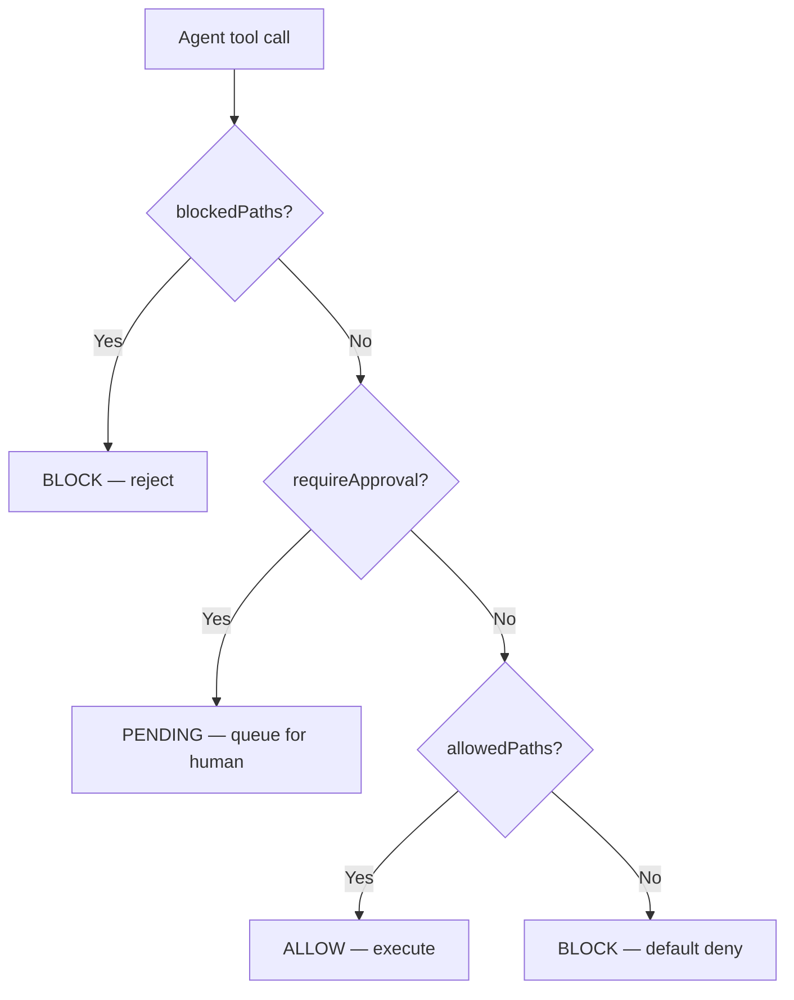

# Policy Engine

Waymark's core enforcement layer turns raw agent tool calls into governed operations. It is the combination of the policy engine, the action ledger, the dashboard, and the terminal log view that makes the rest of the product possible.

## Covered features

- **F-05 — Policy Engine**
- **F-06 — Action Ledger**
- **F-07 — Dashboard UI**
- **F-08 — Terminal Action Viewer**

## Decision pipeline



For file actions, current source checks `blockedPaths`, then `requireApproval` for writes, then `allowedPaths`, then falls back to a default block. For bash commands it checks `blockedCommands`, then `requireApprovalBash`, then `allowedCommands` if present.

## The config surface

```json
{
  "policies": {
    "allowedPaths": ["./src/**", "./README.md"],
    "blockedPaths": ["./.env", "./.env.*"],
    "blockedCommands": ["rm -rf", "regex:DROP\\s+TABLE"],
    "requireApproval": ["./src/db/**"],
    "requireApprovalBash": ["git push", "npm publish"],
    "allowedCommands": ["npm test", "npm run build"],
    "maxBashOutputBytes": 10000
  }
}
```

### What each rule does

- `allowedPaths` — allow matching file reads and writes after higher-priority checks pass
- `blockedPaths` — always block matching paths for both reads and writes
- `blockedCommands` — block matching shell commands by substring or regex
- `requireApproval` — queue matching file writes for human review
- `requireApprovalBash` — queue matching shell commands for human review
- `allowedCommands` — optional shell allowlist; when present, unmatched commands are blocked

## Why the action ledger matters

Waymark writes governed activity to SQLite in `action_log`. Each row can include:

- action id and session id
- tool name
- target path or command payload
- before/after snapshots for writes
- status, decision, matched rule, and human-readable reason
- approval and rejection timestamps
- rollback metadata
- event type and request source

That makes the policy engine explainable after the fact, not just at decision time.

## Dashboard and CLI views

### Dashboard

The dashboard is the primary control plane. It shows pending actions, blocked actions, sessions, approvals, and agent-monitor views. Policy decisions are visible immediately, and users can act on pending rows without leaving the browser.

### Terminal viewer

`waymark logs` is the lightweight terminal equivalent. It reads `/api/actions`, supports `--pending`, `--blocked`, and `--limit`, and prints a concise table of recent actions.

```bash
waymark logs --pending --limit 10
```

## Interactive policy testing

Waymark exposes a direct testing endpoint for hypothetical actions:

```bash
curl -X POST http://localhost:47000/api/policy/test \
  -H "Content-Type: application/json" \
  -d '{"path":"./src/db/schema.sql","action":"write"}'
```

Example response:

```json
{
  "input": "./src/db/schema.sql",
  "resolved": "/project/src/db/schema.sql",
  "decision": "pending",
  "reason": "Path requires approval before execution",
  "matchedRule": "./src/db/**"
}
```

You can use the same route for commands:

```bash
curl -X POST http://localhost:47000/api/policy/test \
  -H "Content-Type: application/json" \
  -d '{"command":"git push origin main"}'
```

## Rule telemetry

`GET /api/policy/hits` aggregates rule-hit counts from the ledger so you can see which rules are blocking, approving, or queueing work most often. That helps distinguish genuinely useful governance from noisy rules that slow a team down.

!!! waymark "Policy is only half the feature"
    The policy engine decides, but the ledger, dashboard, and logs are what make those decisions reviewable, debuggable, and trustworthy in day-to-day use.

## Policy save safety (v5.0.13+)

### Optimistic concurrency

`GET /api/config` now returns an `updatedAt` timestamp alongside the policy object. The dashboard passes this back on every `PUT /api/config/policies` call. If the stored timestamp differs from the one the client sent, the server returns `409 Conflict`:

```json
{
  "error": "Policy configuration was updated by another session since you loaded it",
  "stored_updated_at": "2026-06-03T13:00:00.000Z",
  "your_updated_at":   "2026-06-03T12:55:00.000Z",
  "hint": "Reload the current configuration, merge your changes, then save again"
}
```

This prevents two tabs from silently overwriting each other's security policy changes.

### Pattern validation

Before saving, every glob pattern is validated:

- **Whitespace stripped** — leading/trailing spaces from pasted text are removed automatically
- **Smart-quotes rejected** — Unicode curly-quotes (`"` `"` `'` `'`) return `400` with a per-field error; the pattern would silently never match otherwise
- **Micromatch parse check** — invalid globs are rejected before they can be saved

### Approval route precedence

When multiple approval routes match the same session, the **most-specific condition type wins**:

| Specificity | Condition type | Description |
|-------------|---------------|-------------|
| 4 (highest) | `tool_name` | Matches a specific tool |
| 3 | `risk_level` | Matches based on action reversibility |
| 2 | `action_count` | Matches based on session size |
| 1 (lowest) | `all_sessions` | Catch-all |

Creating a route warns you if it overlaps with an existing route at creation time.
