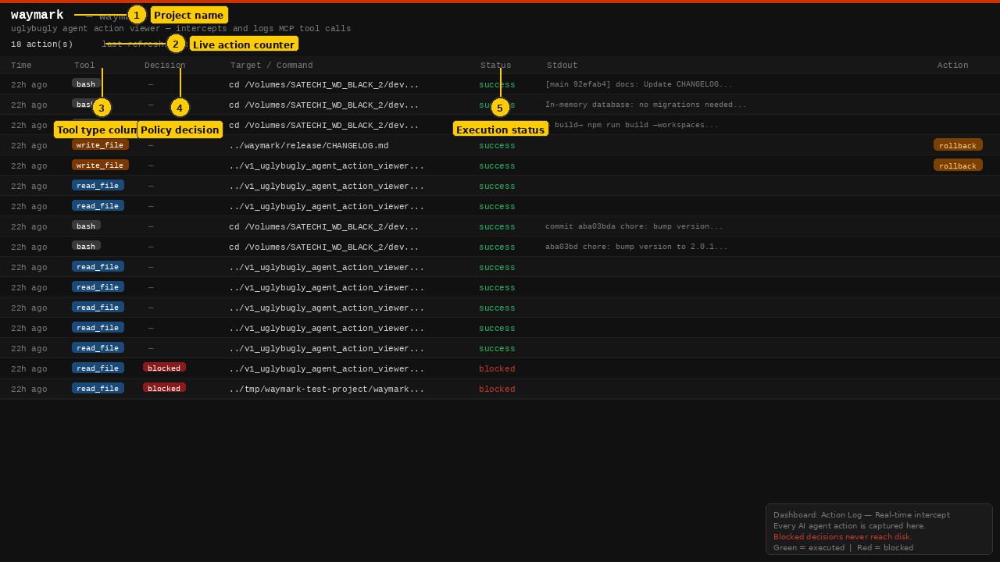
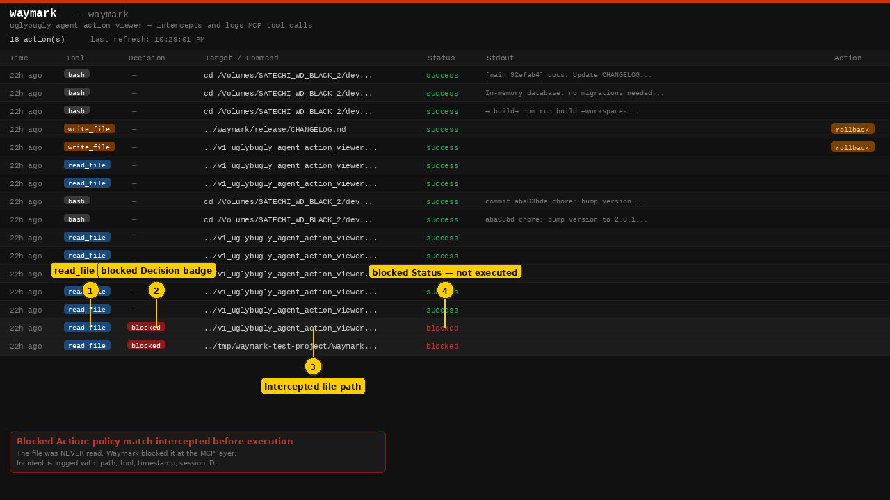
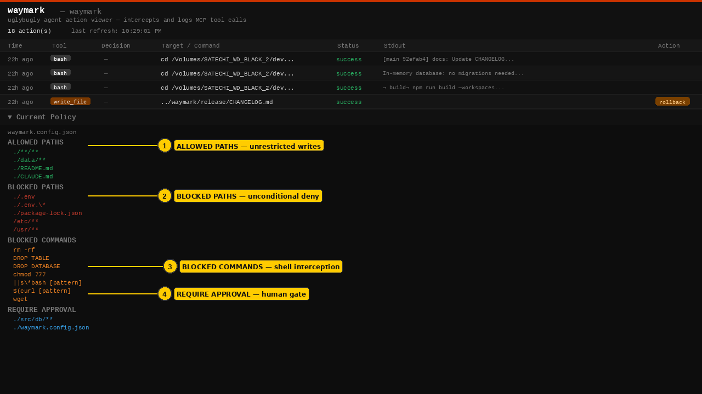
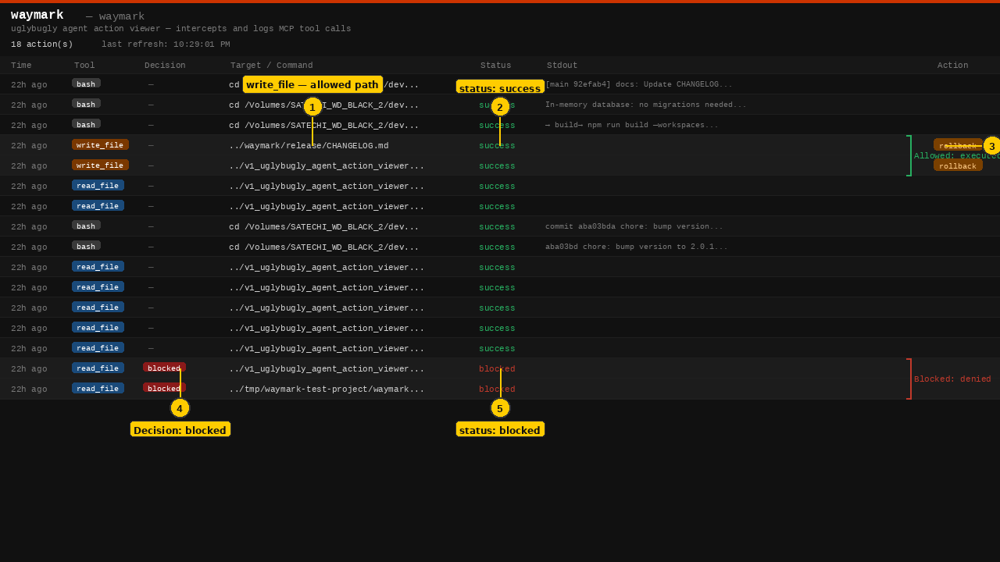

# Feature 01: Team Approval Routing — Screenshot Index

> **[← Back to Feature Overview](../README.md)**

All screenshots are 1280×720 PNG. Numbered yellow callouts identify key UI elements. Data shown is from the live Waymark dashboard.

---

## approval_routing_step_01.png — Dashboard Overview

**What's shown:** The full Waymark action log dashboard with all key columns labelled.

| Callout | Element | Why it matters |
|---------|---------|---------------|
| ① | Project name | Identifies which project's policy is active — one config per repo |
| ② | Live action counter | Shows all actions intercepted in this session (18 total) |
| ③ | Tool column | Identifies the agent action type: `bash`, `write_file`, or `read_file` |
| ④ | Decision column | Policy enforcement result — `blocked` badge or `—` (allowed) |
| ⑤ | Status column | Execution result — `success` (green) or `blocked` (red) |

**Key point for enterprise:** Every AI agent action appears here in real time. Blocked decisions are visible immediately — no polling required.

---

## approval_routing_step_02.png — Blocked Action Rows

**What's shown:** The two `read_file` actions that were blocked by policy, highlighted with callouts.

| Callout | Element | Why it matters |
|---------|---------|---------------|
| ① | `read_file` badge | The tool type that attempted the operation |
| ② | `blocked` Decision badge | Policy matched — action was intercepted before execution |
| ③ | Intercepted file path | The exact file the agent attempted to access |
| ④ | `blocked` Status text | Confirms the action never executed — nothing reached disk |

**Key point for enterprise:** The `blocked` decision and `blocked` status appearing together confirm the file was never accessed. The audit record is immutable.

---

## approval_routing_step_03.png — Current Policy

**What's shown:** The `waymark.config.json` policy expanded in the dashboard, with four policy zones annotated.

| Callout | Element | Why it matters |
|---------|---------|---------------|
| ① | ALLOWED PATHS | File paths the AI agent may write without any gate |
| ② | BLOCKED PATHS | Paths unconditionally denied — `.env`, `/etc/**`, `/usr/**` |
| ③ | BLOCKED COMMANDS | Shell command patterns that are always blocked — `rm -rf`, `DROP TABLE`, `DROP DATABASE` |
| ④ | REQUIRE APPROVAL | Paths that trigger a human approval gate before execution — `./src/db/**`, `./waymark.config.json` |

**Key point for enterprise:** The policy file is the single source of truth. Auditors can review `waymark.config.json` to verify what controls were in place at any point in time.

---

## approval_routing_step_04.png — Allowed vs Blocked Comparison

**What's shown:** The action log with both allowed (write_file with rollback) and blocked (read_file) rows highlighted side-by-side.

| Callout | Element | Why it matters |
|---------|---------|---------------|
| ① | `write_file` — allowed path | The agent wrote to an allowed path; executed normally |
| ② | `status: success` | Execution confirmed — file was written |
| ③ | Rollback available | Allowed writes get a rollback button — reversible |
| ④ | `Decision: blocked` | Policy match — action was denied |
| ⑤ | `status: blocked` | Nothing was written or read — enforcement confirmed |

**Key point for enterprise:** The same dashboard view provides the complete picture: what was allowed, what was blocked, and what is reversible — all in one audit trail.

---

*Screenshots generated from the live Waymark dashboard (v1.0.2) — April 2026*
