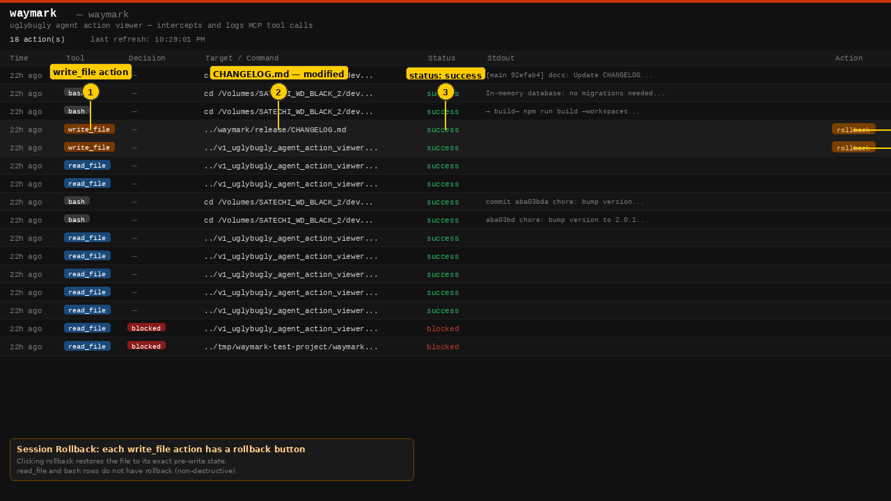
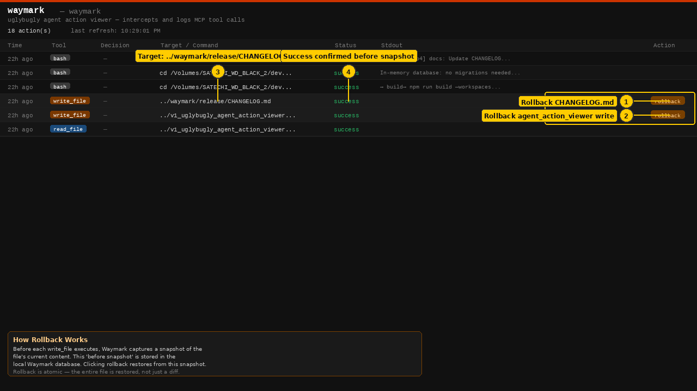
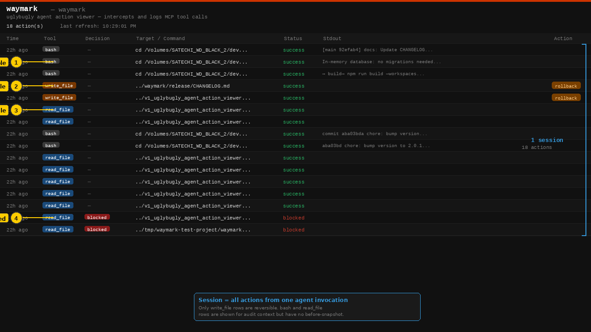
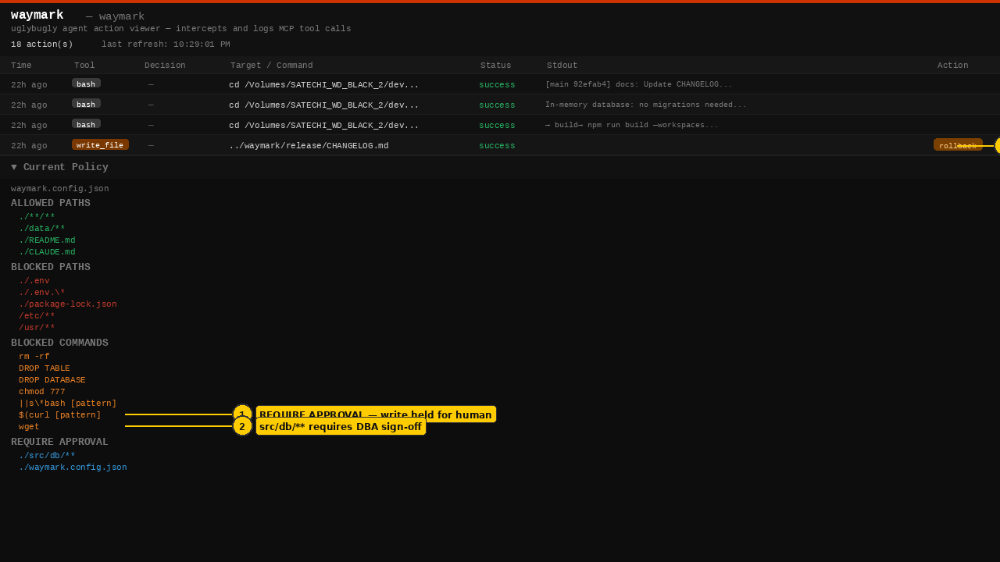

# Feature 02: Session-Level Rollback — Screenshot Index

> **[← Back to Feature Overview](../README.md)**

All screenshots are 1280×720 PNG. Numbered yellow callouts identify key UI elements. Data shown is from the live Waymark dashboard.

---

## session_rollback_step_01.png — Rollback Buttons on Dashboard

**What's shown:** The full action log with two `write_file` rows highlighted — these are the only rows with rollback buttons.

| Callout | Element | Why it matters |
|---------|---------|---------------|
| ① | `write_file` badge | Only write operations have before-snapshots and rollback buttons |
| ② | `CHANGELOG.md — modified` | The exact file that was written; path is the rollback target |
| ③ | `status: success` | Write was confirmed before Waymark stored the before-snapshot |
| ④ | Rollback button (CHANGELOG.md) | Click to restore this file to its pre-write state |
| ⑤ | Rollback button (second write) | Each write_file has its own independent rollback |

**Key point for enterprise:** `bash` and `read_file` rows have no rollback button — they are non-destructive. Only write operations are reversible, and each one is tracked independently.

---

## session_rollback_step_02.png — Rollback Button Close-Up

**What's shown:** The first six rows of the action log with a focus box around the rollback button area, and a detailed explanation of how before-snapshots work.

| Callout | Element | Why it matters |
|---------|---------|---------------|
| ① | Rollback for CHANGELOG.md | Before-snapshot was captured before this write executed |
| ② | Rollback for second write_file | Each write_file gets its own independent snapshot and button |
| ③ | Target: full file path | The rollback restores exactly this file, nothing else |
| ④ | Before-snapshot captured on success | Snapshot is only stored once the write is confirmed — no orphaned snapshots |

**Key point for enterprise:** Rollback is atomic and file-specific. Clicking rollback on one write does not affect other files from the same session. For a full session undo, use the Sessions tab.

---

## session_rollback_step_03.png — Session Grouping — Reversible vs Non-Reversible

**What's shown:** All 18 actions from a single session, with the session bracket on the right and each action type labelled by reversibility.

| Callout | Element | Why it matters |
|---------|---------|---------------|
| ① | `bash` — not reversible | Shell commands have no before-state; shown for audit context only |
| ② | `write_file` — reversible | File writes have before-snapshots; rollback is available |
| ③ | `read_file` — not reversible | Reading a file has no side effect; no rollback needed |
| ④ | `blocked` — never executed | Blocked actions have nothing to roll back — they never ran |

**Key point for enterprise:** A session rollback undoes all `write_file` operations atomically. The session bracket shows the complete scope — 18 actions, of which the 2 write_file operations are the only reversible ones.

---

## session_rollback_step_04.png — Policy + requireApproval Connection

**What's shown:** The policy section with the `REQUIRE APPROVAL` paths annotated, alongside the rollback button on an approved write.

| Callout | Element | Why it matters |
|---------|---------|---------------|
| ① | REQUIRE APPROVAL section | Paths in this list require a human approval gate before executing |
| ② | `./src/db/**` — DBA sign-off | Database migrations must be approved; they still get a rollback after execution |
| ③ | Approved writes get rollback | Even actions that went through the approval gate are reversible post-execution |

**Key point for enterprise:** Approval routing and session rollback are complementary, not alternatives. Approval prevents bad writes; rollback recovers from approved writes that turn out to be wrong.

---

*Screenshots generated from the live Waymark dashboard (v1.0.2) — April 2026*
