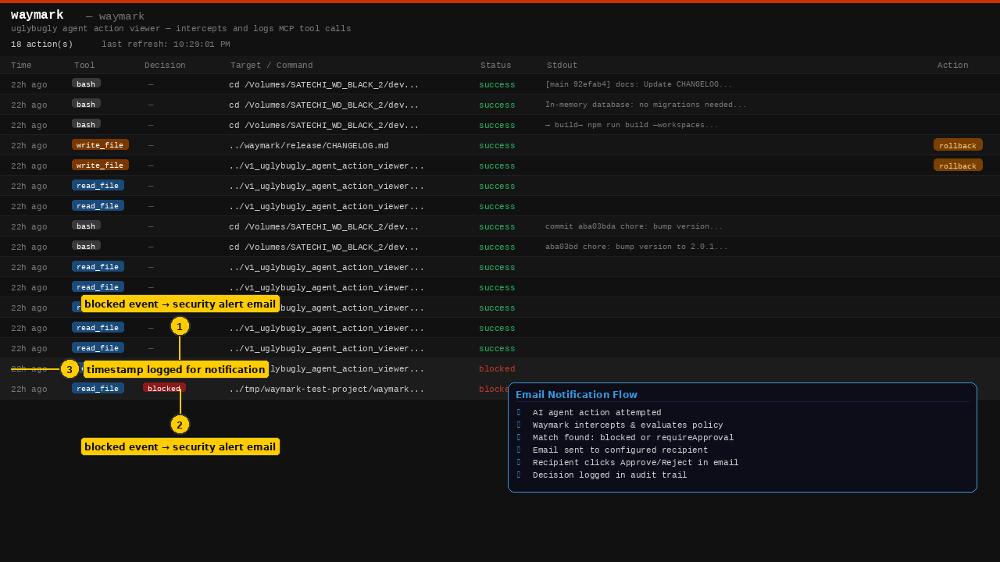
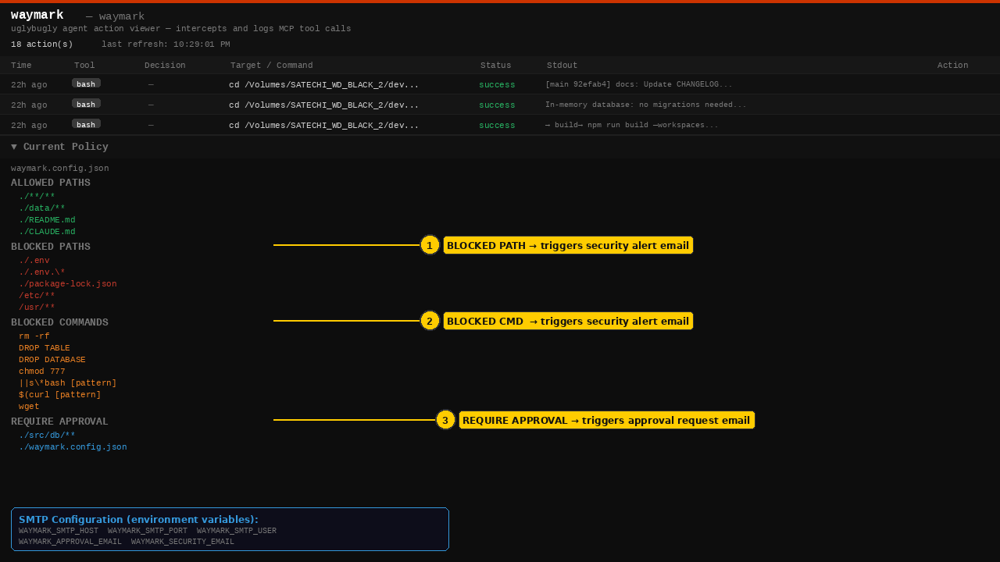
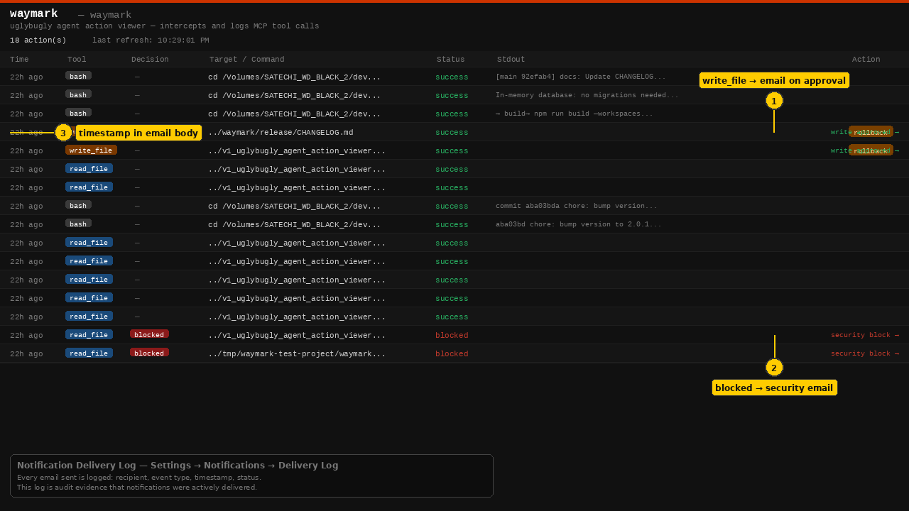

# Feature 03: Email Notifications — Screenshot Index

> **[← Back to Feature Overview](../README.md)**

All screenshots are 1280×720 PNG. Numbered yellow callouts identify key UI elements. Data shown is from the live Waymark dashboard.

---

## email_notifications_step_01.png — Blocked Events as Email Triggers



**What's shown:** The dashboard with blocked actions highlighted and an email notification flow diagram showing the 6-step path from AI agent action to approval decision.

| Callout | Element | Why it matters |
|---------|---------|---------------|
| ① | Blocked event — security alert email | When a `blocked` decision fires, a security alert is sent to `WAYMARK_SECURITY_EMAIL` |
| ② | Second blocked event | Each blocked event generates its own notification — no batching or deduplication |
| ③ | Timestamp logged for notification | The timestamp in the dashboard is the same timestamp included in the email body |

**Email notification flow (diagram):**
1. AI agent action attempted
2. Waymark intercepts and evaluates policy
3. Match found: `blocked` or `requireApproval`
4. Email sent to configured recipient
5. Recipient clicks Approve/Reject in email
6. Decision logged in audit trail

**Key point for enterprise:** Notifications are not optional status updates — they are the delivery mechanism for the governance workflow. An approval request that never reaches an approver is equivalent to no approval gate at all.

---

## email_notifications_step_02.png — Policy Sections That Trigger Emails



**What's shown:** The full `waymark.config.json` policy in the dashboard, with each section annotated to show which type of email notification it triggers.

| Callout | Element | Notification triggered |
|---------|---------|----------------------|
| ① | BLOCKED PATHS | Security alert email to `WAYMARK_SECURITY_EMAIL` |
| ② | BLOCKED COMMANDS | Security alert email to `WAYMARK_SECURITY_EMAIL` |
| ③ | REQUIRE APPROVAL | Approval request email to configured approver |

**SMTP configuration (shown in legend):**
```
WAYMARK_SMTP_HOST   WAYMARK_SMTP_PORT   WAYMARK_SMTP_USER
WAYMARK_APPROVAL_EMAIL   WAYMARK_SECURITY_EMAIL
```

**Key point for enterprise:** The three policy sections map to two email notification types. Security alerts are fired immediately on block. Approval request emails are sent when an action enters the pending queue and include one-click Approve/Reject links.

---

## email_notifications_step_03.png — Audit Trail Showing Notification-Generating Events



**What's shown:** The full action log with email notification labels on the right side for the rows that generate emails, and a delivery log explanation.

| Row type | Notification label | Recipient |
|----------|-------------------|-----------|
| `write_file` (success) | `write approved →` | Agent/session owner |
| `read_file` (blocked) | `security block →` | `WAYMARK_SECURITY_EMAIL` |

**Delivery log:** Every email sent by Waymark is recorded under **Settings → Notifications → Delivery Log** with:
- Recipient address
- Event type (pending approval / security block / rejection / escalation)
- Timestamp sent
- Delivery status

**Key point for enterprise:** The delivery log is audit evidence that notifications were actively sent — not just generated. This satisfies audit requirements for demonstrating that approval requests were delivered to reviewers, not just queued.

---

*Screenshots generated from the live Waymark dashboard (v1.0.2) — April 2026*
