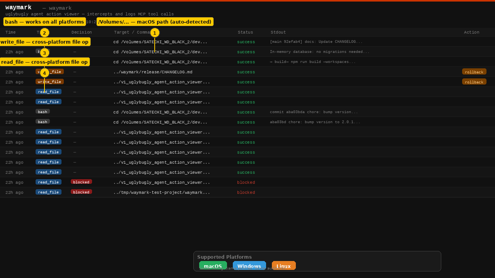
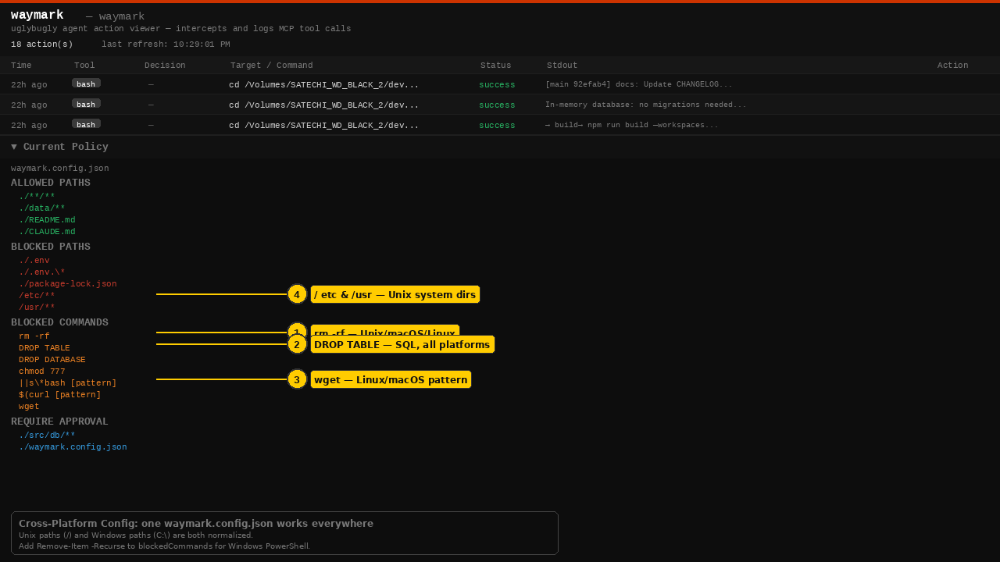
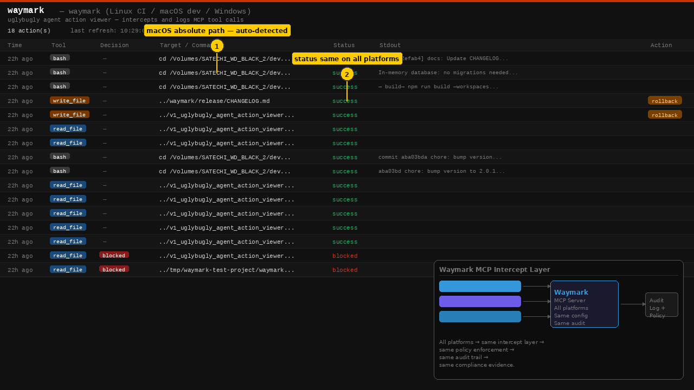

# Feature 04: Multi-Platform Support — Screenshot Index

> **[← Back to Feature Overview](../README.md)**

All screenshots are 1280×720 PNG. Numbered yellow callouts identify key UI elements. Data shown is from the live Waymark dashboard running on macOS.

---

## multi_platform_step_01.png — Dashboard on macOS



**What's shown:** The full Waymark dashboard as it appears on macOS. The macOS absolute path is visible in the Target column, auto-detected by Waymark. The platform badge row shows all three supported platforms.

| Callout | Element | Why it matters |
|---------|---------|---------------|
| ① | `/Volumes/...` — macOS path | Waymark auto-detects the OS and normalises paths — no config required |
| ② | `bash` — works on all platforms | The `bash` tool type is intercepted on macOS/Linux; PowerShell equivalents intercepted on Windows |
| ③ | `write_file` — cross-platform | File write interception uses OS-native paths, but the policy uses forward slashes on all platforms |
| ④ | `read_file` — cross-platform | Read interception is identical across platforms |

**Platform support badges shown:** macOS · Windows · Linux

**Key point for enterprise:** The dashboard UI, policy structure, and audit format are identical across all three platforms. A screenshot from a Windows machine would look exactly the same, with Windows-style paths in the Target column.

---

## multi_platform_step_02.png — Cross-Platform Blocked Commands



**What's shown:** The policy section with `BLOCKED COMMANDS` annotated, showing that the same config covers Unix, SQL, and network download patterns that appear across all platforms.

| Callout | Element | Platform coverage |
|---------|---------|------------------|
| ① | `rm -rf` | Unix/macOS/Linux — recursive file deletion |
| ② | `DROP TABLE` | All platforms — SQL destruction via any CLI |
| ③ | `wget` | Linux/macOS — network download tool |
| ④ | `/etc/**` and `/usr/**` blocked paths | Unix system directories — protected on macOS and Linux |

**For Windows PowerShell coverage**, add to `blockedCommands`:
```
Remove-Item -Recurse
del /s /q
format
```

**Key point for enterprise:** A single `waymark.config.json` can contain both Unix and Windows command patterns. Waymark evaluates the full list on every platform — there is no platform-conditional syntax.

---

## multi_platform_step_03.png — MCP Intercept Architecture



**What's shown:** The dashboard with an architecture diagram showing how multiple AI agent platforms feed into the single Waymark MCP intercept layer, which produces a unified audit log regardless of source platform.

**Architecture flow:**
```
Claude Code        ─┐
GitHub Copilot CLI ─┼──▶  Waymark MCP Server  ──▶  Audit Log + Policy
Claude Desktop     ─┘      (all platforms)          (same format)
```

| Callout | Element | Why it matters |
|---------|---------|---------------|
| ① | macOS absolute path in Target | Path format adapts to OS; policy logic does not |
| ② | `status: success` — same on all platforms | Status, decision, and action columns are identical regardless of platform |

**Key point for enterprise:** Compliance reports and audit evidence look the same whether generated from a Windows developer's machine, a macOS engineer's laptop, or a Linux CI/CD pipeline. There are no platform-specific audit gaps.

---

*Screenshots generated from the live Waymark dashboard (v1.0.2, macOS) — April 2026*
